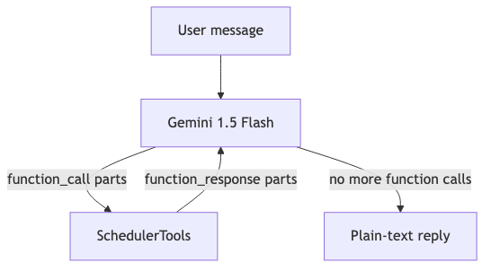
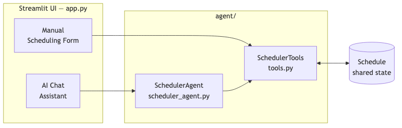
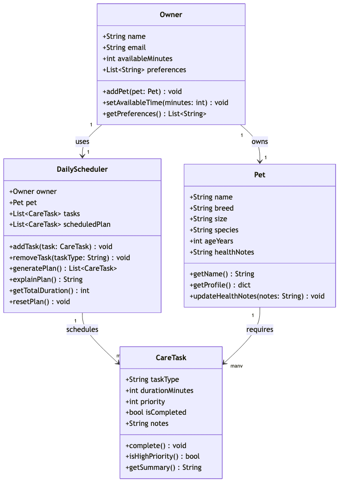

# PawPal+ — AI Pet Care Scheduler

PawPal+ helps pet owners plan their daily pet care routines. You can add tasks manually or chat with an AI assistant that builds and manages your schedule for you.

## What it does

- **Manual scheduling** — add, remove, and complete care tasks through a simple UI
- **AI Assistant** — chat with an AI that understands your pet's needs and builds a schedule automatically
- **Conflict detection** — warns you if tasks exceed your available time or if duplicates exist

## Project structure

```
applied-ai-system-project/
├── app.py                    # Main app — run this to start
├── agent/
│   ├── scheduler_agent.py    # AI agent that powers the chat assistant
│   └── tools.py              # The scheduling logic the agent can use
├── models/
│   └── schemas.py            # Data definitions (Task, Pet, Owner, Schedule)
├── tests/
│   └── test_scheduler.py     # Automated tests
├── .env                      # Your secret API key goes here (never share this)
├── requirements.txt          # Python packages needed
└── README.md
```

## Setup (step by step)

### 1. Install dependencies

Open your terminal, navigate to the project folder, and run:

```bash
python3 -m pip install -r requirements.txt
```

### 2. Get a free Groq API key

1. Go to [console.groq.com](https://console.groq.com) and sign up for free
2. Click **API Keys** in the left sidebar
3. Click **Create API Key** and copy the key

### 3. Add your key to the `.env` file

Open the `.env` file in the project folder and add your key:

```
GROQ_API_KEY=your_key_here
```

Replace `your_key_here` with the key you copied. Save the file.

> **Important:** Never share your `.env` file or post your API key anywhere — treat it like a password.

## Run the app

```bash
python3 -m streamlit run app.py
```

Your browser will open automatically. The manual scheduling UI works without an API key. The **AI Assistant** tab requires your `GROQ_API_KEY` to be set.

> **Note:** After changing your `.env` file, restart the app for the new key to take effect.

## Run tests

```bash
python3 -m pytest tests/
```

All tests run without needing an API key.

## How the AI works

### Agent loop



When you send a message, the AI decides which scheduling tools to call (like `add_task` or `check_conflicts`), runs them, and keeps going until it has a complete answer for you.

### Shared state



The AI assistant and the manual UI share the same schedule — so if the AI adds a task, you'll see it appear in the task table instantly, and vice versa.

### Class diagram



## What you can ask the AI

Here are some example messages to try in the AI Assistant tab:

- "Add a 30-minute morning walk at high priority"
- "Build me a full day schedule for my dog Mochi with feeding, grooming, and playtime"
- "Check if there are any conflicts in my schedule"
- "I finished the walk — mark it as complete"
- "Remove the grooming task"
- "Show me a summary of today's schedule"

## Available AI tools

These are the actions the AI can perform behind the scenes:

| Tool | What it does |
|---|---|
| `add_task` | Add a care task with a name, duration, and priority |
| `remove_task` | Remove a task by name |
| `list_tasks` | Show all current tasks |
| `get_schedule` | Show tasks sorted by priority |
| `check_conflicts` | Check for time overruns or duplicate tasks |
| `complete_task` | Mark a task as done |
| `get_summary` | Show a summary of the owner, pet, and schedule status |
| `reset_schedule` | Clear all tasks and start fresh |
